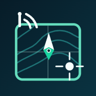

<p align="center">
  
</p>

# VHF GPS Code

**Partagez un point GPS entre équipiers à la VHF, avec une phrase codée plutôt qu’une suite de coordonnées.**

Pensée pour les sorties de pêche en groupe, VHF GPS Code est une application web installable sur téléphone. Chaque sortie possède son propre secret, partagé par invitation. Les équipiers peuvent ensuite coder et décoder leurs positions **sans connexion Internet en mer**.

**[Ouvrir l’application](https://julienbranco.github.io/VHF-GPS-Code/)** · [Développer et publier](DEVELOPPEMENT.md)

## Une phrase à la radio, un point pour votre groupe

Vous avez trouvé un point à partager. L’application le transforme en **quatre mots reliés par ET ou OU**. Votre équipier saisit la phrase dans son application, puis vous effectuez un échange de contrôle avant de confirmer la position.

| Qui parle ? | Exemple d’échange |
| --- | --- |
| Vous transmettez la phrase codée | **THON MYSTIQUE ET ALBATROS ALTRUISTE** |
| Votre équipier annonce son mot de retour | **BISCUIT** |
| Vous annoncez la confirmation finale, si le retour correspond | **CLARINETTE** |

*Exemple illustratif : les mots dépendent du point et de la sortie. ET ou OU fait partie du code.*

Les coordonnées sont validées après la confirmation finale. Pour retrouver le même point, les équipiers doivent utiliser **la même invitation et la même zone**.

## Ce que propose l’application

- **Émettre et recevoir des positions codées**, avec contrôle du message, mot de retour et confirmation finale.
- **Préparer une sortie et partager son invitation**, sans compte ni inscription.
- **Vérifier la synchronisation** grâce à l’empreinte radio de la sortie et à l’alias de zone, avec un rappel visible pendant le défilement.
- **Choisir une zone sur une carte embarquée**, avec un catalogue de 34 zones couvrant les façades de France métropolitaine et la Corse, ainsi que des zones personnalisées ou éphémères.
- **Retrouver les points dans le journal de la sortie**, puis lancer le suivi GPS : position actuelle du bateau, distance, direction, trace temporaire et estimations d’arrivée lorsque les mesures le permettent.
- **Convenir d’un changement de canal par un mot codé**, avec un mémo commun aux équipiers de la sortie.
- **Utiliser l’application hors connexion**, une fois l’application et la sortie installées.

## Commencer une sortie

1. **Au port, avec du réseau**, ouvrez [l’application](https://julienbranco.github.io/VHF-GPS-Code/), installez-la puis lancez-la depuis son icône. L’accueil propose l’installation ou les instructions adaptées à Android et iPhone.
2. Un équipier choisit **Préparer une nouvelle sortie**, sélectionne la zone de pêche, vérifie puis crée et active la sortie.
3. Il partage l’invitation avec les participants. Chacun choisit **Recevoir une invitation** et confirme son installation, de préférence avant le départ.
4. En mer, utilisez **ÉMETTRE** pour générer la phrase d’un point, ou **RECEVOIR** pour saisir celle de votre équipier. Suivez les étapes de contrôle affichées.

**Après un changement de zone**, annoncez et comparez l’alias à la radio avec vos équipiers, puis confirmez le changement dans l’application.

## Zones, précision et suivi

Chaque zone couvre **250 × 250 km**, découpés en mailles de **100 m**. Sur la carte, le contour coloré délimite les positions que vous pouvez coder : choisissez une zone qui couvre votre secteur de pêche.

La position décodée correspond au centre d’une maille. La qualité du point dépend aussi du GPS ou des coordonnées saisies. **Le point transmis reste fixe** : si vous vous déplacez, transmettez un nouveau point.

Le suivi GPS affiche séparément le point choisi et la position du bateau. Il signale les relevés anciens ou imprécis et suspend les estimations lorsqu’ils ne permettent plus un calcul fiable. Sa trace disparaît à la fermeture du suivi.

La carte embarquée présente un fond côtier simplifié et les limites d’encodage. **Elle ne contient ni sondes ni balisage** ; le suivi ne calcule pas de route tenant compte des dangers. L’application accompagne les échanges entre pêcheurs et ne remplace ni une carte marine ni les fonctions de détresse de la VHF.

## Données et invitations

Les calculs s’effectuent sur votre appareil. **Les positions et le journal ne sont pas envoyés à un serveur.** La sortie et ses réglages sont conservés dans le stockage local du navigateur.

**L’invitation contient le secret de la sortie : gardez-la entre les participants.** Préparez une nouvelle sortie pour chaque sortie en mer.

Une seule sortie est conservée sur le téléphone. En créer ou installer une autre remplace la précédente et son journal. Conservez votre invitation : les données locales peuvent être effacées par le navigateur ou par l’utilisateur.

## Développer le projet

L’application utilise HTML, CSS et JavaScript, sans serveur applicatif. Les sources sont dans `sources/` ; les versions distribuées sont générées dans `releases/`.

Avec **Node.js 22 ou plus récent**, lancez l’aperçu des sources :

```powershell
node tools/live-server.cjs 8083
```

Puis ouvrez [http://127.0.0.1:8083/](http://127.0.0.1:8083/). Cet aperçu sert aux retouches locales ; ses invitations ne doivent pas être partagées pour une vraie sortie.

Pour installer les outils de test et vérifier les sources sans générer de publication :

```powershell
npm ci
npm run test:install
npm run test:sources
```

Les tests couvrent notamment les échanges radio, les invitations, les alias, les zones, les cartes, le suivi GPS, la sauvegarde et la reprise hors connexion. Les permissions GPS, l’installation et la mise en veille restent à vérifier sur de vrais téléphones.

Consultez le **[guide de développement et de publication](DEVELOPPEMENT.md)** pour l’organisation des fichiers, les deux serveurs locaux, la génération des releases et leur conservation. Les fichiers d’une publication existante ne se modifient pas à la main.

## Auteur

Logiciel édité par **Julien Branco** · [**brancojulien@yahoo.fr**](mailto:brancojulien@yahoo.fr) · 2026
